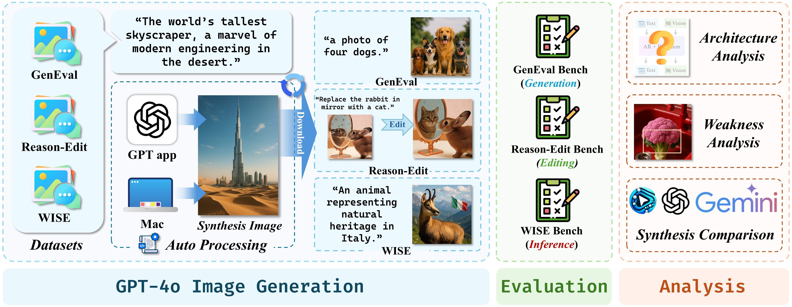
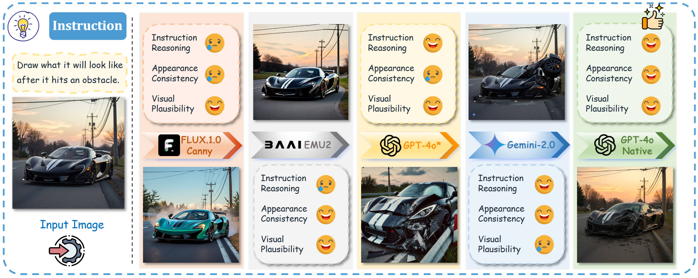
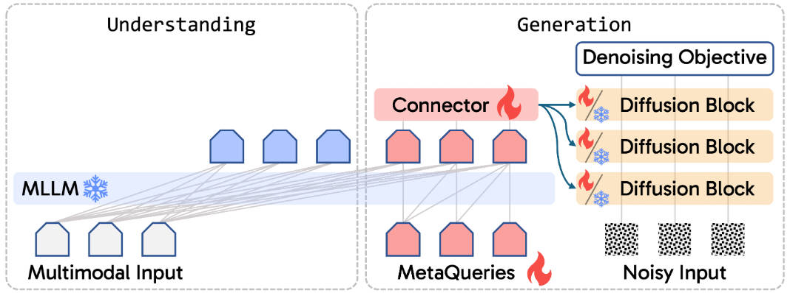

#  Awesome-GPT-Image-generation
📑🔍💡 An extensive repository of tools, research, and resources for leveraging GPT models in image generation tasks.

## 📢 Latest Updates
* Apr-10-2025: 🎉 ${\color{red} First\ update!}$ Add 4 papers and 2 tool.

## Table of contents
- 🔨 [Tools](#tools)
- 📄 [Papers](#papers)

## Tools
* [Automated GPT-4o Script](https://github.com/PicoTrex/GPT-ImgEval)
* [claude-chatgpt-mcp](https://github.com/syedazharmbnr1/claude-chatgpt-mcp)

## Papers
### 1. GPT-ImgEval: A Comprehensive Benchmark for Diagnosing GPT4o in Image Generation
**Authors:** Zhiyuan Yan, Junyan Ye, Weijia Li, Zilong Huang, Shenghai Yuan, Xiangyang He, Kaiqing Lin, Jun He, Conghui He, Li Yuan
<details span>
<summary><b>Abstract</b></summary>
The recent breakthroughs in OpenAI's GPT4o model have demonstrated surprisingly good capabilities in image generation and editing, resulting in significant excitement in the community. This technical report presents the first-look evaluation benchmark (named GPT-ImgEval), quantitatively and qualitatively diagnosing GPT-4o's performance across three critical dimensions: (1) generation quality, (2) editing proficiency, and (3) world knowledge-informed semantic synthesis. Across all three tasks, GPT-4o demonstrates strong performance, significantly surpassing existing methods in both image generation control and output quality, while also showcasing exceptional knowledge reasoning capabilities. Furthermore, based on the GPT-4o's generated data, we propose a classification-model-based approach to investigate the underlying architecture of GPT-4o, where our empirical results suggest the model consists of an auto-regressive (AR) combined with a diffusion-based head for image decoding, rather than the VAR-like architectures. We also provide a complete speculation on GPT-4o's overall architecture. In addition, we conduct a series of analyses to identify and visualize GPT-4o's specific limitations and the synthetic artifacts commonly observed in its image generation. We also present a comparative study of multi-round image editing between GPT-4o and Gemini 2.0 Flash, and discuss the safety implications of GPT-4o's outputs, particularly their detectability by existing image forensic models. We hope that our work can offer valuable insight and provide a reliable benchmark to guide future research, foster reproducibility, and accelerate innovation in the field of image generation and beyond.
</details>

[📄 Paper](https://arxiv.org/pdf/2504.02782) | [💻 Code](https://github.com/PicoTrex/GPT-ImgEval) | [📁 Dataset](https://huggingface.co/datasets/Yejy53/GPT-ImgEval)



### 2. Envisioning Beyond the Pixels: Benchmarking Reasoning-Informed Visual Editing
**Authors:** Xiangyu Zhao, Peiyuan Zhang, Kexian Tang, Hao Li, Zicheng Zhang, Guangtao Zhai, Junchi Yan, Hua Yang, Xue Yang, Haodong Duan
<details span>
<summary><b>Abstract</b></summary>
Large Multi-modality Models (LMMs) have made significant progress in visual understanding and generation, but they still face challenges in General Visual Editing, particularly in following complex instructions, preserving appearance consistency, and supporting flexible input formats. To address this gap, we introduce RISEBench, the first benchmark for evaluating Reasoning-Informed viSual Editing (RISE). RISEBench focuses on four key reasoning types: Temporal, Causal, Spatial, and Logical Reasoning. We curate high-quality test cases for each category and propose an evaluation framework that assesses Instruction Reasoning, Appearance Consistency, and Visual Plausibility with both human judges and an LMM-as-a-judge approach. Our experiments reveal that while GPT-4o-Native significantly outperforms other open-source and proprietary models, even this state-of-the-art system struggles with logical reasoning tasks, highlighting an area that remains underexplored. As an initial effort, RISEBench aims to provide foundational insights into reasoning-aware visual editing and to catalyze future research. Though still in its early stages, we are committed to continuously expanding and refining the benchmark to support more comprehensive, reliable, and scalable evaluations of next-generation multimodal systems.
</details>

[📄 Paper](https://arxiv.org/pdf/2504.02826) | [💻 Code](https://github.com/PhoenixZ810/RISEBench) | [📁 Dataset](https://github.com/PhoenixZ810/RISEBench/tree/main/data)



### 3. Transfer between Modalities with MetaQueries
**Authors:** Xichen Pan, Satya Narayan Shukla, Aashu Singh, Zhuokai Zhao, Shlok Kumar Mishra, Jialiang Wang, Zhiyang Xu, Jiuhai Chen, Kunpeng Li, Felix Juefei-Xu, Ji Hou, Saining Xie
<details span>
<summary><b>Abstract</b></summary>
Unified multimodal models aim to integrate understanding (text output) and generation (pixel output), but aligning these different modalities within a single architecture often demands complex training recipes and careful data balancing. We introduce MetaQueries, a set of learnable queries that act as an efficient interface between autoregressive multimodal LLMs (MLLMs) and diffusion models. MetaQueries connects the MLLM's latents to the diffusion decoder, enabling knowledge-augmented image generation by leveraging the MLLM's deep understanding and reasoning capabilities. Our method simplifies training, requiring only paired image-caption data and standard diffusion objectives. Notably, this transfer is effective even when the MLLM backbone remains frozen, thereby preserving its state-of-the-art multimodal understanding capabilities while achieving strong generative performance. Additionally, our method is flexible and can be easily instruction-tuned for advanced applications such as image editing and subject-driven generation.
</details>

[📄 Paper](https://arxiv.org/pdf/2504.06256) | [🌐 Project Page](https://xichenpan.com/metaquery/)



### 4. An Empirical Study of GPT-4o Image Generation Capabilities
**Authors:** Sixiang Chen, Jinbin Bai, Zhuoran Zhao, Tian Ye, Qingyu Shi, Donghao Zhou, Wenhao Chai, Xin Lin, Jianzong Wu, Chao Tang, Shilin Xu, Tao Zhang, Haobo Yuan, Yikang Zhou, Wei Chow, Linfeng Li, Xiangtai Li, Lei Zhu, Lu Qi
<details span>
<summary><b>Abstract</b></summary>
The landscape of image generation has rapidly evolved, from early GAN-based approaches to diffusion models and, most recently, to unified generative architectures that seek to bridge understanding and generation tasks. Recent advances, especially the GPT-4o, have demonstrated the feasibility of high-fidelity multimodal generation, their architectural design remains mysterious and unpublished. This prompts the question of whether image and text generation have already been successfully integrated into a unified framework for those methods. In this work, we conduct an empirical study of GPT-4o's image generation capabilities, benchmarking it against leading open-source and commercial models. Our evaluation covers four main categories, including text-to-image, image-to-image, image-to-3D, and image-to-X generation, with more than 20 tasks. Our analysis highlights the strengths and limitations of GPT-4o under various settings, and situates it within the broader evolution of generative modeling. Through this investigation, we identify promising directions for future unified generative models, emphasizing the role of architectural design and data scaling.
</details>

[📄 Paper](https://arxiv.org/pdf/2504.05979)

## ❤️ BibTeX 

```bib
@article{yan2025gpt-imgeval,
      title={GPT-ImgEval: A Comprehensive Benchmark for Diagnosing GPT4o in Image Generation}, 
      author={Zhiyuan Yan and Junyan Ye and Weijia Li and Zilong Huang and Shenghai Yuan and Xiangyang He and Kaiqing Lin and Jun He and Conghui He and Li Yuan},
      journal={arXiv preprint arXiv:2504.02782},
      year={2025},
}
```

